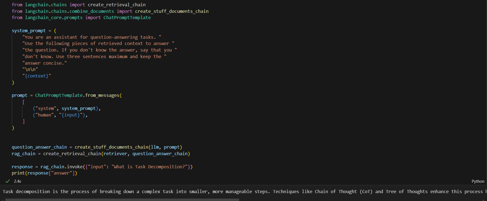

# TALLER7 - Parte 2-  Lang Chain RAG

Este proyecto utiliza la biblioteca LangChain para desarrollar una aplicación que implementa un sistema de Recuperación Asistida por Generación (RAG). Este enfoque permite mejorar la integración y recuperación de información utilizando modelos de lenguaje. A continuación, se detallan la arquitectura y los componentes del proyecto, junto con instrucciones para su instalación y ejecución.

## Arquitectura y Componentes

El notebook se organiza de forma modular y comprende los siguientes componentes clave:

### 1. Instalación de Librerías

Se instalan y actualizan las bibliotecas `langchain`, `langchain-community`, y `langchain-chroma` para garantizar la compatibilidad y el acceso a las últimas funcionalidades de LangChain.

### 2. Configuración de Variables de Entorno

- `LANGCHAIN_TRACING_V2`: Esta variable activa el seguimiento avanzado de operaciones en LangChain.
- `LANGCHAIN_API_KEY`: La clave API de LangChain se configura mediante el módulo `getpass`, lo cual garantiza que se mantenga segura y no se exponga directamente en el código.

### 3. Implementación y Configuración de RAG

El núcleo de este proyecto utiliza LangChain para la implementación de un sistema de Recuperación Asistida por Generación. Esta configuración avanzada incluye:

   - Carga de datos de fuentes externas.
   - Creación e indexación de una base de conocimientos.
   - Optimización de las consultas mediante lenguaje natural para facilitar el acceso a información relevante.


## Instalación y Ejecución

Para instalar las dependencias y ejecutar el proyecto en un entorno Jupyter Notebook, sigue estos pasos:

### 1. Clonar el Repositorio

```bash
git clone https://github.com/sebastian2929/Taller7-AREP-Parte2.git
cd Taller7-AREP-Parte2
```
**2. Instalar dependencias:**
Abre el archivo LangChainRAG.ipynb en Jupyter Notebook y ejecuta las primeras celdas. La instalación de dependencias es automática e incluye:
```
%pip install --quiet --upgrade langchain langchain-community langchain-chroma
```

**3. Configurar las variables de entorno:**
Asegúrate de establecer las claves de API y configuraciones necesarias:
```
import getpass
import os

os.environ["LANGCHAIN_TRACING_V2"] = "true"
os.environ["LANGCHAIN_API_KEY"] = getpass.getpass("Ingresa tu clave de API de LangChain: ")
```

**4. Ejecutar el Notebook:**
Ejecuta el resto de las celdas en el notebook para ver el funcionamiento completo de RAG, incluyendo ejemplos de recuperación de información.

## Prueba



## Licencia

Este proyecto está bajo la licencia de Creative Commons Reconocimiento-CompartirIgual 4.0 Internacional (CC BY-SA 4.0) - Ver el archivo [LICENSE](LICENSE.md) para más detalles.

---

## Autor

- __Sebastian Zamora Urrego__
